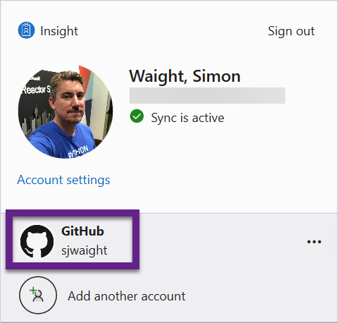
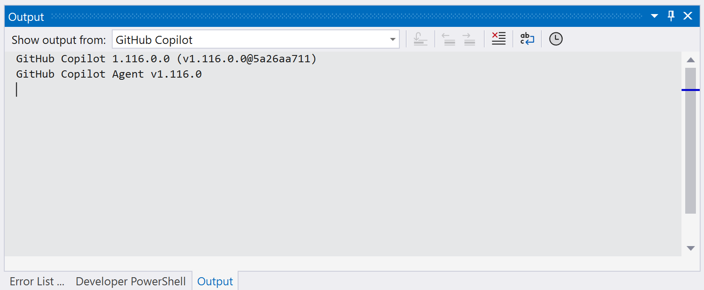
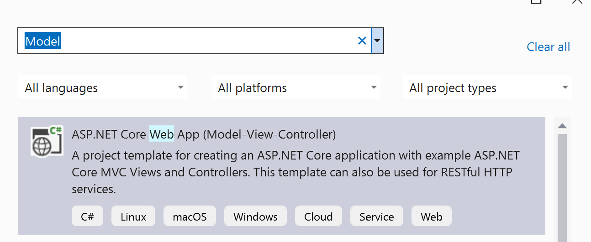

# GitHub Copilot lab for Visual Studio 2022

Welcome to the GitHub Copilot Lab using Visual Studio 2022. In this lab we will recreate the classic ASP.NET MVC MvcMusicStore sample by using Copilot to help us build out our code.

If you get stuck at any time you can use the original [MvcMusicStore reference documentation](https://learn.microsoft.com/aspnet/mvc/overview/older-versions/mvc-music-store/) to help you along, though it's important to note that some markup / code is no longer applicable with the new MVC template in ASP.NET in .NET 6.

## Introduction

If you're used to working with Intellisense or Intellicode in Visual Studio, then get ready for turbo-charged code recommendations! GitHub Copilot can help you deliver code faster, with less key strokes, and can even help you understand code you are looking at by using Copilot Chat.

A key part of starting to work with Copilot is to learning how to write effective prompts that help Copilot really understand what you're looking for. You might know the solution already, but imaging if you didn't, or that it would take a while to write even just boilerplate code.

Code samples in this lab are often referenced, but the goal is not to copy/paste the samples - it's really about driving Copilot to produce the code for you. You might need more than one go at a prompt to get the solution you want, but it's all part of the process!

### It's all about the prompts

When you work with generative AI services like GitHub Copilot you use prompts to intiate the AI service to generate a response. Prompt engineering becomes an important skill to develop as it can help you get the results you want. Experiment with prompt formats and be specific, even indicating which programming language you would like the solution in. Copilot will sometimes complete your prompts and you should look at it's suggestions. If you have it installed, try out Copilot Chat as well, especially if you have code errors - see if Copilot Chat can explain why you are having the error(s) and how to fix them. 

Also, you can use multi-line comments in C# to explain more complex scenarios you need Copilot to help with.

```csharp
/* Create a method that takes these arguments:
   - Name (string)
   - Age (int)
   - HasPets (bool) */
```

If you want to view alternative suggestions, or discover other ways to use GitHub Copilot, read the [official documentation for more tips](https://docs.github.com/en/copilot/getting-started-with-github-copilot?tool=visualstudio#seeing-your-first-suggestion-1).

## Prerequisites

In order to complete the steps in this lab you will need:

- Visual Studio 2022 (v17.4 or later is required). Community edition is fine to use.
  - Make sure to have the C# web workload installed.
  - Ensure that LocalDb is installed (it should be by default).
- GitHub Copilot Extension installed ([see instructions](https://docs.github.com/en/copilot/getting-started-with-github-copilot?tool=visualstudio))
- Copilot Chat (optional, but highly recommended).

> [!NOTE]
> You can use the GitHub Copilot 30 day trial for this workshop.

If the extension is correctly installed you should see the following banner displayed in Visual Studio when you have a project open.


If you don't see the banner, but have the extension installed, check that you are logged into the GitHub account that has Copilot enabled.



## If you get stuck

There is a completed sample project that includes prompts at [CopilotMvCMusicStore](https://github.com/sjwaight/CopilotMvCMusicStore). **Don't** just be lazy and copy the prompts. 😂

It's also recommended to open the GitHub Copilot output window so you can see what's happening behind the scnenes.



## Getting Started

1. Open Visual Studio and choose `Create a new project`
2. Select the `ASP.NET Core Web App (Model-View-Controller)` C# Project type
  
3. There is **no need** to accept the use of SSL certificates if you don't already have them configured.
4. When prompted enter `CopilotMvcMusicStore` for the project name.
5. Run the project by hitting F5 and make sure it runs without error.

-----

[Next - Adding a Controller](01-Step01.md)
